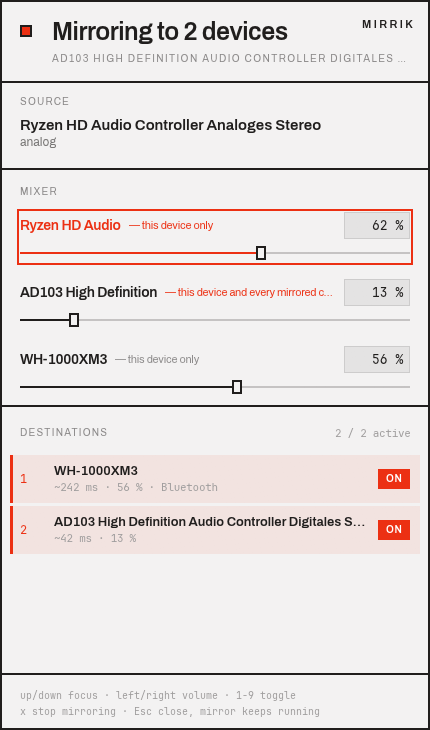
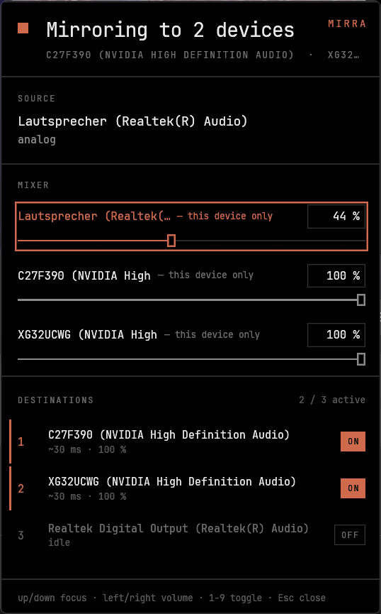
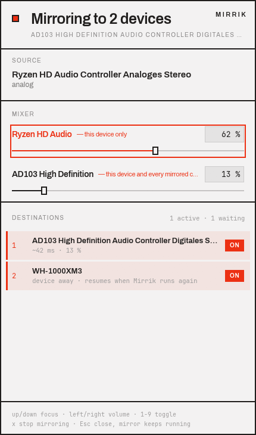
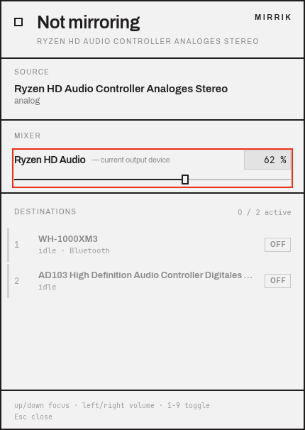

# Mirrik

**Play the same sound on two or more output devices at once — on Windows and Linux.**

Speakers and headphones running together, or two headsets so you and someone else can watch
the same film — Mirrik takes whatever your computer is already playing and sends a copy to
as many outputs as you like. Nothing to install alongside it, no virtual cable to wire up,
and once you switch it off there's nothing left to clean up.



---

## So, what does it actually do?

Here's the annoying thing: neither Windows nor Linux lets you send sound to two outputs at
once. You pick a device, and everything else goes silent. The usual fixes — virtual audio
cables, Voicemeeter, `combine-sink` — all work by creating a fake device that you then have
to select, remember is there, and eventually clean up.

Mirrik skips all of that. It just listens to whatever your current output is already
playing and copies that stream to whichever devices you pick. **No virtual device ever gets
created**, your default output is never touched, and every other program on your machine
notices nothing. Turn it off, and there's nothing left over — not a setting, not a leftover
device, nothing.

You'll like this if you ever want to *watch a film together on two headsets*, *keep your
speakers and headphones live at the same time*, *share game audio with the person next to
you*, or *pipe sound into a second room over HDMI*.

<sub>Keywords: play audio on two devices at once · dual audio output · mirror sound to
multiple outputs · Windows WASAPI loopback · Linux PipeWire loopback · share audio with two
headphones · simultaneous playback · second audio output · no virtual audio cable ·
alternative to Voicemeeter / VB-CABLE / Audio Router</sub>

## Two skins, and you don't have to pick

Mirrik checks your system's light/dark setting the moment it opens and dresses itself
accordingly. Light is ink on paper; dark is true black — every unlit pixel stays off, which
is exactly what you want on an OLED panel.

| Light | OLED |
|---|---|
|  |  |

No setting, no theme picker buried in a menu. Your desktop already knows which one you want,
so Mirrik just asks it.

> **Heads up on Windows:** the choice gets locked in the moment the window opens. Flipping
> your desktop to dark while the window is already up won't repaint it — Windows only tells
> a program its theme once, at launch. Just close it and open it again. Since this is a
> window you summon with a key and dismiss with `Esc` anyway, that's barely a hiccup in
> practice.

## Is it going to work on your setup?

| | Supported | Notes |
|---|---|---|
| **Windows 11 / 10** | yes | Uses WASAPI loopback. Nothing to install, no driver, no admin rights needed |
| **Linux (PipeWire)** | yes | Uses `module-loopback`. PipeWire is required — details below |
| **Linux (PulseAudio only)** | no | Mirrik will refuse and tell you why. On plain PulseAudio, a crash would leave a loopback behind for good — not a risk worth taking |
| **macOS** | not yet | Nobody's written that backend |

You're not limited to two devices, either — mix and match as many as you want. Analogue, USB,
HDMI and Bluetooth outputs all work together, and if their sample rates don't match, Mirrik
converts on the fly so you don't have to think about it.

## What you get

- **Mirror to as many devices as you like** — add and remove them one at a time, and
  everything else just keeps playing.
- **Nothing gets left behind.** Off really means off: no leftover device, no changed
  default output, no service quietly running in the background.
- **Independent volume per device.** Everyone sets their own level, and it doesn't touch
  anyone else's.
- **Different sample rates? No problem.** A 192 kHz output can happily mirror to a 48 kHz
  headset.
- **Low delay**, and it's measured, not guessed — shown per destination (typically 30 ms on
  Windows, 42 ms on Linux). Bluetooth adds roughly 200 ms of its own, and Mirrik labels those
  destinations so you know before you notice it in your ears.
- **Survives you changing things.** Switch your main output mid-session and the mirror
  follows along. Unplug a destination and Mirrik doesn't panic or throw an error — it just
  waits, ready to pick back up the moment the device returns.
- **Matches your system theme** automatically, light or OLED black.
- **Fully keyboard-driven window**, plus a proper command line with `--json` on everything
  that reports something — script it however you like.



## Getting it installed

There are two ways in, and they land you in the same place. The **guided script** asks
before every step, needs no administrator rights, and keeps track of what it wrote so you
can undo it later. **By hand** is really just a copy and a key binding — the script only
automates that for you and checks the usual gotchas first.

Take the script unless you have a reason not to. It's the easier path, and it's the one
that's actually been run and battle-tested.

Grab the source first, if you don't have it already:

```sh
git clone https://github.com/Kris-023/mirrik.git
cd mirrik
```

### Windows

```powershell
powershell -ExecutionPolicy Bypass -File install.ps1               # set up
powershell -ExecutionPolicy Bypass -File install.ps1 -Uninstall    # take it all back
```

> Don't let `-ExecutionPolicy Bypass` throw you — it's nothing shady. Windows refuses to run
> *any* unsigned `.ps1` file, even one you wrote yourself five minutes ago.

The script checks your machine first — Windows version, architecture, and whether you have
a real display driver, since the window itself is OpenGL and may not open over Remote
Desktop (the command line still will, though). Once that's clear, it copies both programs, puts them
on your `PATH`, and offers you a Start menu shortcut with a hotkey attached.

That hotkey gets double-checked before it's handed to you: once against shortcuts that
already claim the same combination — Windows just silently gives it to whichever it finds
first — and once against your keyboard layout, because Windows delivers AltGr as Ctrl+Alt
behind the scenes. On a German layout, `Ctrl+Alt+Q` would quietly cost you your `@` key for
as long as the shortcut exists.

Changed your mind? `-Uninstall` shows you everything it found first — the programs, the
`PATH` entry, the shortcut, the state folder — and removes all of it after one confirmation.
A running mirror gets stopped before anything else, since Windows won't let you delete a
running `.exe` anyway; say no to the confirmation and it leaves everything untouched.

<details>
<summary><b>Prefer doing it by hand?</b></summary>

1. Put `mirrik.exe` and `mirrik-gui.exe` somewhere permanent, like
   `%LOCALAPPDATA%\Programs\Mirrik`.
2. **Double-click `mirrik-gui.exe`** — that's the one with the window and device list.
   `mirrik.exe` is the command-line version, and it opens the same window too, so grabbing
   the "wrong" one isn't a real problem.
3. For the hotkey: right-click `mirrik-gui.exe` → *Show more options* → *Create shortcut*,
   move it into your Start menu, then *Properties* → *Shortcut key* → press your
   combination. Windows only allows `Ctrl+Alt+<key>`, so steer clear of keys your layout
   reaches with AltGr, and keep the shortcut in the Start menu or on the Desktop — anywhere
   else and the hotkey just stops working.

</details>

<details>
<summary><b>Got a SmartScreen warning? Here's what that means</b></summary>

> **Windows protected your PC** — Microsoft Defender SmartScreen prevented an unrecognised
> app from starting.

Don't panic — there's no *Run* button on that dialog on purpose, but you're not stuck.
Click **More info → Run anyway**.

What this actually means is *"Microsoft hasn't seen this program very often"*, not *"this
program is dangerous."* Mirrik doesn't carry a code-signing certificate — those cost a few
hundred euros a year, and this is a free hobby project. To be fair, this is also the exact
dialog real malware relies on you clicking through without thinking, so don't just trust it
because we said so: the source is right here in this repo, and you're always welcome to
build it yourself instead.

The warning mark actually comes from the **download**, not the program itself. `install.ps1`
strips it for you automatically, which is why you usually won't see the dialog after running
it. Doing things by hand instead? Right-click → *Properties* → *Unblock*, or run
`Unblock-File .\mirrik-gui.exe`. Build it from source yourself, and there's no mark to begin
with.

</details>

### Linux

You'll need **PipeWire** and four of its command-line tools — `pactl`, `pw-cli`, `pw-dump`,
`pw-metadata`. Mirrik drives PipeWire through those rather than linking `libpipewire`
directly, and quite a few distributions package the daemon and its tools separately — so
your system can be running PipeWire just fine and still be missing `pw-cli`. Worth checking
before you start.

```sh
pactl info | grep 'Server Name'      # should say PipeWire
./install.sh
```

If something's missing, the script tells you the exact command to fix it for your
distribution (Debian, Ubuntu, Fedora — including the image-based ones on `rpm-ostree` — Arch,
openSUSE, Alpine, Void, Gentoo, NixOS). From there it installs both binaries, adds a desktop
entry, and figures out the right key binding for whatever you're running:

| | |
|---|---|
| **Hyprland, Sway, i3, river, bspwm/sxhkd, awesome** | shows you the exact config lines and offers to append them |
| **GNOME, Cinnamon, XFCE** | sets it up for you via `gsettings` / `xfconf-query`, if you say yes |
| **niri, KDE Plasma** | gives you the lines to paste in yourself — both of these rewrite their own config, so auto-appending would be riskier than helpful |

Nothing gets written without being shown to you first. Whatever it does add is clearly
marked so you can find it again later, the same block never gets written twice even if you
re-run the script, and generated configs (Nix, Home Manager, chezmoi) are left completely
alone — appending to those would only last until the next rebuild anyway.

There's no `--uninstall` flag here on purpose — this script only ever shows you commands to
run yourself, it never removes anything on your behalf. What it *does* do is remember
exactly what it wrote (in a small state file, nothing fancy), so when it's done it can print
you the precise commands for *your* setup instead of a generic guess. A typical run ends
with something like this:

```sh
rm ~/.local/bin/mirrik ~/.local/bin/mirrik-gui
rm ~/.local/share/applications/mirrik.desktop
# and delete the '# --- Mirrik ---' block from your compositor config
```

Run the script again later with a different desktop or a different install folder, and it'll
also point out anything the *previous* run left behind — so nothing quietly turns into an
orphaned dconf entry or a stray config block you forgot about.

<details>
<summary><b>Prefer doing it by hand?</b></summary>

```sh
cargo build --release

install -Dm755 target/release/mirrik     ~/.local/bin/mirrik
install -Dm755 target/release/mirrik-gui ~/.local/bin/mirrik-gui
```

Needs Rust 1.95 or newer (`rustup update` if you're not sure) — that floor comes from
`egui`/`eframe`, not from anything Mirrik itself does.

Then bind the window to a key — that's really the intended way to use this thing day to
day. Hyprland, as an example:

```
bind = SUPER SHIFT, M, exec, mirrik-gui
```

Wayland compositors place windows themselves, so you'll also want a rule that floats and
centres it (Hyprland shown here; before version 0.49 these were called `windowrulev2`):

```
windowrule = float, class:^(mirrik)$
windowrule = center, class:^(mirrik)$
```

</details>

## Using it day to day

### The window

Open it, and the first thing it tells you is the state: whether anything's being mirrored
right now, and where to. Below that sits the source, then one fader per active device, then
the list of devices you could add.



It's built to be run entirely from the keyboard:

| Key | Does |
|---|---|
| `↓` `↑` or `j` `k` | move the focus (faders and devices share one chain) |
| `→` `←` or `l` `h` | nudge the focused fader in 5 % steps |
| `1` … `9` | switch that device on or off directly |
| `Enter` | on a device: add it, or remove it if it's already active |
| `x` | stop mirroring, everywhere |
| `Esc` or `q` | close the window — the mirror keeps running |

One thing worth remembering: closing the window does **not** stop the mirror. That's what
`x` is for.

### The command line

```sh
mirrik devices                  # list outputs, * marks the current one
mirrik on airpods               # start mirroring to one device
mirrik on airpods hdmi          # ... or several at once
mirrik add speakers             # add one more while running
mirrik remove hdmi              # drop one, keep the rest
mirrik toggle airpods           # add if absent, remove if present
mirrik status                   # what is running
mirrik off                      # stop everything
mirrik volume airpods 60        # read or set a device's volume, 0-100
```

You don't need to type the full device name — any unique part of it works, so `airpods` is
plenty. If that matches more than one device, Mirrik just tells you so instead of guessing
which one you meant.

Anything that reports something takes `--json`, and `status --quiet` exits `0` while
mirroring and `1` otherwise, so you can drop it straight into a shell condition:

```sh
if mirrik status --quiet; then notify-send "still mirroring"; fi
```

## A few things worth knowing

**How it actually works, under the hood.** On Windows, a WASAPI loopback client captures
whatever the default output is playing, and a render client pushes that to each destination,
with the audio engine handling any sample-rate conversion along the way. On Linux,
`module-loopback` taps the monitor of your current sink. Both sides deliberately avoid ever
creating a device of their own — that's not an implementation detail, it's the whole point.

**One small process per destination.** Each mirrored device is kept alive by its own tiny
background process. That's what makes "off means gone" an actual guarantee rather than a
promise: if that process dies, for any reason at all, that destination disappears right
along with it. Nothing can outlive a crash.

**Volume is genuinely per device.** Faders apply *after* the point where the copy is taken,
so each device's level really is its own — turning your speakers down won't quieten your
headphones. If a driver happens to apply gain *before* that point, the fader tells you so
honestly in the window instead of pretending it's in control.

**Nothing gets remembered between sessions.** After a reboot, sound just plays to one device
again, like normal. Mirroring is meant to be something you turn on deliberately for the
moment someone's listening along with you — not a state Mirrik tries to restore for you.

**About the delay.** A mirrored device runs a touch behind the original — roughly 30 ms on
Windows, 42 ms on Linux. In practice you won't notice unless two devices happen to be in the
same room and you're specifically listening for it. Bluetooth is a different story, though:
its own buffering tacks on about 200 ms, which *is* noticeable, so those destinations are
clearly labelled in the interface.

**Over a really long session**, the clocks on two devices can drift apart by a tiny amount.
Mirrik quietly corrects for this the whole time it's running, so the only trace you might
notice is an occasional, faint tick after several hours of continuous use.

## Licence

Licensed under the [MIT License](LICENSE): you may use, copy, modify, merge, publish,
distribute, sublicense, and sell copies of this software, for any purpose, including
commercial use — provided the copyright notice and this permission notice are included in
all copies or substantial portions of the software. Provided "as is", without warranty of
any kind.

The window's typeface is set in [Archivo](https://github.com/Omnibus-Type/Archivo) and
[JetBrains Mono](https://github.com/JetBrains/JetBrainsMono), both licensed separately under
the SIL Open Font License. That license applies only to the two font files, not to the rest
of the project, and its full text ships alongside the fonts in `gui/assets/`.

"Mirrik" is a made-up word, chosen specifically because it wasn't already in use anywhere
that matters — no company, product, or package by that name on any registry checked before
picking it. This project has no connection to anything else you might find under a similar
name.
